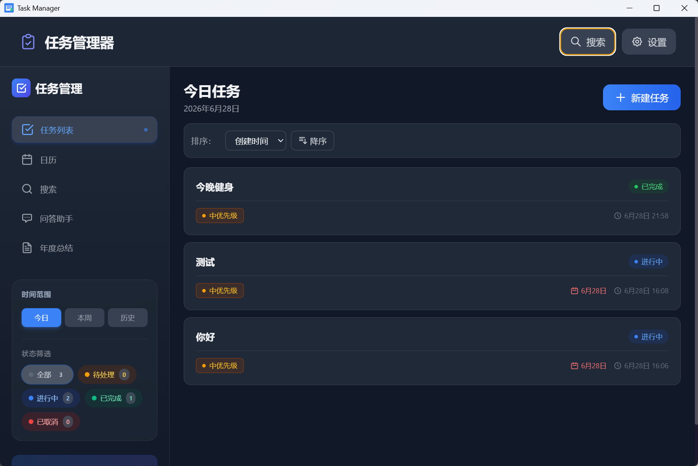
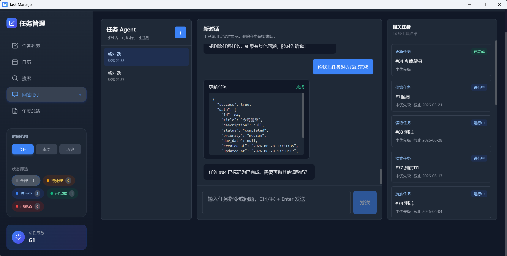

<div align="center">

# Task Manager

**A local-first, AI-native task manager that actually understands what you mean.**
**一款本地优先、AI 原生的任务管理器——它真的能听懂你在说什么。**

[](./package.json)
[](./LICENSE)
[](#-supported-platforms)
[](./CONTRIBUTING.md)
[](https://www.electronjs.org/)

📥 **[Download Latest Release](https://github.com/jiahaocare-hue/notebook/releases)** ·
⭐ **[Star on GitHub](https://github.com/jiahaocare-hue/notebook)** ·
💬 **[Report Issue](https://github.com/jiahaocare-hue/notebook/issues)**

</div>

---

> **EN** · Task Manager is a desktop app that turns natural language into structured task operations. Built on a **Function Calling + ReAct Agent loop**, it lets you chat with your task list — create, query, update, and delete tasks through conversation, with **Human-in-the-Loop confirmation** for destructive actions and an **immutable activity ledger** that keeps a reliable audit trail even after tasks are deleted. All data stays on your machine.
>
> **中文** · Task Manager 是一款把自然语言变成结构化任务操作的桌面应用。基于 **Function Calling + ReAct Agent 循环**架构，让你能直接和任务清单对话——创建、查询、更新、删除任务全部通过聊天完成，删除等危险操作需 **Human-in-the-Loop 二次确认**，并通过**不可篡改的活动事件账本**保留可靠审计轨迹（即使任务被删除，历史也仍在）。所有数据都留在你本机。

---

## 📸 Screenshots / 截图

<p align="center">
  
</p>

<p align="center">
  
  
</p>

---

## ✨ Why Task Manager / 为什么选择 Task Manager

### 🤖 AI Agent — Talk to your tasks / 和任务清单对话
- **Function Calling + ReAct loop** — the LLM picks the right tool, observes the result, and iterates (up to 5 rounds).
- **8 tools**: `create_task` · `batch_create_tasks` · `update_task` · `delete_task` · `get_task` · `query_tasks` · `search_tasks` · `query_activity`.
- **SSE streaming** responses — see the agent's reasoning and tool calls in real time.
- **Multi-turn chat** with persistent sessions (`chat_sessions` + `chat_messages`); your conversation survives page switches and app restarts.
- **Quick prompts** built-in — "今天创建了哪些任务？" / "帮我创建这周的五个待办" — one click to run.

### 🛡️ Human-in-the-Loop Safety / 人机二次确认
- Destructive operations (e.g. `delete_task`) **require explicit confirmation** through a frontend dialog before execution.
- The agent cannot delete your data on its own — you always have the final say.

### 📒 Immutable Activity Ledger / 不可篡改的活动账本
- Every `task_created` / `task_updated` / `task_status_changed` / `task_deleted` event is written to the independent `activity_events` table.
- Each event stores `task_title_snapshot` and `content_snapshot`, so **the audit trail survives even after the task itself is deleted**.
- Records are non-deletable — perfect for review, compliance, and answering "我上周删了哪些任务？".

### 🔍 Hybrid Search that Understands Intent / 真正理解意图的混合搜索
- **Keyword** — exact match in title & description.
- **Semantic** — powered by local BAAI/bge-small-zh-v1.5 embeddings (`@xenova/transformers`, runs fully offline).
- **Image OCR** — Tesseract.js extracts text from task images (Chinese + English), so pictures become searchable.
- **Hybrid** — combines all of the above for the most relevant results.

### 🔒 Local-first & Private / 本地优先，隐私至上
- All tasks, images, and chat history are stored in a local SQLite database — **nothing leaves your machine**.
- **Bring your own LLM**: OpenAI, Azure OpenAI, locally-hosted models, or any OpenAI-compatible endpoint.
- No account, no cloud sync, no tracking.

### 📅 Rich Views & 📄 Word Export / 多视图 + Word 导出
- **Today / Week / History / Calendar** views out of the box.
- **Mini calendar** for quick date navigation.
- Export period summaries and task lists to **`.docx`** (powered by `docx`) — great for weekly reviews and standups.

### 🖥️ Cross-platform / 跨平台
- One codebase, three platforms: **Windows (NSIS)** · **macOS (DMG)** · **Linux (AppImage)**.
- Auto-update check via `electron-updater`.

---

## 🚀 Quick Start / 快速开始

### Option 1 — Download the installer / 下载安装包（推荐）

👉 Go to the [Releases page](https://github.com/jiahaocare-hue/notebook/releases), download the installer for your platform, and run it. Done.

👉 前往 [Releases 页面](https://github.com/jiahaocare-hue/notebook/releases)，下载对应平台的安装包，双击安装即可。

### Option 2 — Run from source / 从源码运行

```bash
git clone https://github.com/jiahaocare-hue/notebook.git
cd notebook
npm install            # 会自动 rebuild sharp & better-sqlite3
npm run electron:dev   # 启动开发模式（前端 + Electron 同时起）
```

Requirements: Node.js 18+, npm 9+.

---

## 🛠️ Tech Stack / 技术栈

| Category / 类别 | Technology / 技术 |
|---|---|
| Frontend / 前端 | React 18 · TypeScript 5 · Vite 5 · Tailwind CSS |
| Desktop / 桌面 | Electron 28 · electron-updater |
| Database / 数据库 | SQLite (better-sqlite3) |
| AI Agent | Function Calling + ReAct loop · SSE streaming |
| Embeddings / 嵌入模型 | @xenova/transformers (BAAI/bge-small-zh-v1.5, local) |
| OCR | Tesseract.js (Chinese + English) |
| Image processing / 图像处理 | Sharp |
| Document export / 文档导出 | docx (.docx) |
| Packaging / 打包 | electron-builder |

---

## 🧭 Feature Index / 功能索引

| Module / 模块 | Highlights / 亮点 |
|---|---|
| **Tasks / 任务** | Create / edit / delete · 4 statuses (pending / in_progress / completed / cancelled) · 3 priorities · due dates · subtasks (parent_id) · sort order |
| **AI Chat / AI 对话** | Function Calling agent · 8 tools · multi-turn · streaming · HITL · quick prompts |
| **Search / 搜索** | Keyword · Semantic · Image OCR · Hybrid |
| **Activity Ledger / 活动账本** | Immutable event log · survives deletion · snapshot fields |
| **Calendar / 日历** | Month view · date navigation · today/week/history filters |
| **Summary / 摘要** | LLM-generated summaries · stats · `.docx` export |
| **Images / 图片** | Local storage · auto OCR · searchable image text |
| **Settings / 设置** | Custom LLM endpoint · custom data dir · auto DB backup |

---

## 🔧 Configuration / 配置说明

### LLM 配置 / LLM Configuration

To use the AI chat & summary features, configure your LLM endpoint in **Settings**:

1. Click the ⚙️ settings icon.
2. Find the **LLM 配置** section.
3. Fill in:
   - **API Key** — your LLM API key.
   - **Base URL** — API endpoint (e.g. `https://api.openai.com/v1`).
   - **Model** — model name (optional).
   - **Timeout** — request timeout in seconds (default 30).
   - **Verify SSL** — whether to verify TLS certificates.

Compatible providers / 兼容服务商:
- OpenAI · Azure OpenAI · 本地部署的 LLM · 任何兼容 OpenAI API 的服务

### 数据存储位置 / Data Directory

Default locations / 默认位置:
- Windows: `%APPDATA%/task-manager/data`
- macOS: `~/Library/Application Support/task-manager/data`
- Linux: `~/.config/task-manager/data`

Customize it in **Settings → 数据目录**. The new path takes effect on next app launch. A backup of `tasks.db` is automatically created under `backups/` (keeps the most recent 10) before any DB init.

### Database Schema / 数据库结构

| Table | Purpose |
|---|---|
| `tasks` | Task records / 任务数据 |
| `task_history` | Task change history / 任务变更历史 |
| `task_embeddings` | Semantic search vectors / 嵌入向量 |
| `image_texts` | OCR text from images / 图片 OCR 文本 |
| `activity_events` | **Immutable** audit ledger / 不可篡改的活动账本 |
| `chat_sessions` | AI chat sessions / AI 对话会话 |
| `chat_messages` | AI chat messages / AI 对话消息 |

---

## 💻 Development / 开发

### Available Scripts / 可用脚本

| Command | Description |
|---|---|
| `npm run dev` | Start Vite dev server / 启动前端开发服务器 |
| `npm run build` | Build frontend + Electron code / 构建前端与 Electron 代码 |
| `npm run build:electron` | Compile Electron main process only / 仅编译主进程 |
| `npm run electron:dev` | Start dev mode (frontend + Electron) / 开发模式 |
| `npm run electron:build` | Package the app / 打包应用 |
| `npm run typecheck` | TypeScript type check / 类型检查 |
| `npm run lint` | ESLint + typecheck / 代码检查 |
| `npm run regression:smoke` | Read-only regression smoke test / 只读回归烟测 |
| `npm run agent:smoke` | Agent tool dispatch smoke test / Agent 工具烟测 |

### Logs / 日志

App logs live in `logs/app.log` under the Electron user data directory. Default level is `info`/`warn`/`error`; set `LOG_LEVEL=debug` for verbose output. Logs auto-rotate at 2MB, keeping the 5 most recent files.

---

## 📁 Project Structure / 项目结构

```
notebook/
├── electron/                  # Electron 主进程
│   ├── main.ts                # 主进程入口
│   ├── preload.ts             # 预加载脚本
│   ├── ipc/                   # IPC handlers
│   │   ├── agent.ts           #   AI Agent / chat / HITL
│   │   ├── ask.ts             #   Ask page API
│   │   ├── chat.ts            #   Chat session persistence
│   │   ├── tasks.ts           #   Task CRUD
│   │   ├── search.ts          #   Hybrid search
│   │   ├── ocr.ts             #   OCR pipeline
│   │   └── llm.ts             #   LLM config & summary
│   └── services/              # 后端服务
│       ├── agent.ts           #   ReAct Agent loop + SSE
│       ├── agentTools.ts      #   8 tool definitions & dispatcher
│       ├── systemPrompt.ts    #   System prompt builder
│       ├── activityLedger.ts  #   Immutable activity ledger
│       ├── chatStore.ts       #   Chat session/message persistence
│       ├── embedding.ts       #   Local embedding service
│       ├── ocr.ts             #   Tesseract.js OCR service
│       ├── llm.ts             #   LLM service
│       ├── llmRequest.ts      #   Streaming chat completions
│       ├── query.ts           #   Query planner
│       ├── search.ts          #   Hybrid search engine
│       ├── database.ts        #   SQLite connection & migrations
│       └── logger.ts          #   Rotating logger
├── src/                       # 前端源码
│   ├── components/            # React 组件
│   │   ├── ConfirmDialog/     #   HITL 确认弹窗
│   │   ├── TaskDetail/        #   任务详情（含 ActivityTimelineSection）
│   │   ├── MiniCalendar/      #   迷你日历
│   │   ├── SearchBar/         #   搜索栏
│   │   ├── Settings/          #   设置面板
│   │   └── ...
│   ├── pages/
│   │   ├── Ask/               #   AI 对话页
│   │   ├── TodayTasks/        #   今日任务
│   │   ├── WeekTasks/         #   本周任务
│   │   ├── HistoryTasks/      #   历史任务
│   │   ├── Calendar/          #   日历视图
│   │   ├── Search/            #   搜索页
│   │   └── Summary/           #   摘要 + Word 导出
│   ├── context/               # React Context
│   ├── ipc/                   # 前端 IPC 封装
│   ├── types/                 # TypeScript 类型
│   └── utils/                 # 工具函数
├── resources/
│   ├── models/BAAI-bge-small-zh-v1d5/   # 本地嵌入模型
│   └── icon.*                 # 应用图标
├── scripts/                   # 烟测脚本
└── electron-builder.yml       # 打包配置
```

---

## 🗺️ Roadmap / 路线图

- [x] AI Agent with Function Calling + ReAct loop
- [x] Human-in-the-Loop confirmation for destructive actions
- [x] Immutable activity ledger (survives task deletion)
- [x] Persistent multi-turn chat sessions
- [x] SSE streaming responses
- [x] Word (.docx) summary & task list export
- [ ] Vector search across chat history
- [ ] Plugin system for custom tools
- [ ] Mobile companion (read-only sync)

> Have an idea? [Open an issue](https://github.com/jiahaocare-hue/notebook/issues) and let's talk.
> 有想法？[提个 Issue](https://github.com/jiahaocare-hue/notebook/issues) 一起聊聊。

---

## 🤝 Contributing / 贡献

Contributions are what make the open-source community such an amazing place to learn, inspire, and create. Any contributions you make are **greatly appreciated**.

1. Fork the repo / Fork 本仓库
2. Create your feature branch (`git checkout -b feature/AmazingFeature`)
3. Commit your changes (`git commit -m 'Add some AmazingFeature'`)
4. Push to the branch (`git push origin feature/AmazingFeature`)
5. Open a Pull Request

欢迎提交 Issue 和 Pull Request！

---

## 📄 License / 许可证

Distributed under the MIT License. See [`LICENSE`](./LICENSE) for more information.

本仓库基于 MIT 协议开源。

---

<div align="center">

**If this project helps you, please consider giving it a ⭐ — it helps others discover it too.**
**如果这个项目对你有帮助，欢迎点个 ⭐ —— 你的一颗星会让更多人看到它。**

[⭐ Star this repo](https://github.com/jiahaocare-hue/notebook) ·
[📥 Download](https://github.com/jiahaocare-hue/notebook/releases) ·
[💬 Report issue](https://github.com/jiahaocare-hue/notebook/issues)

</div>
